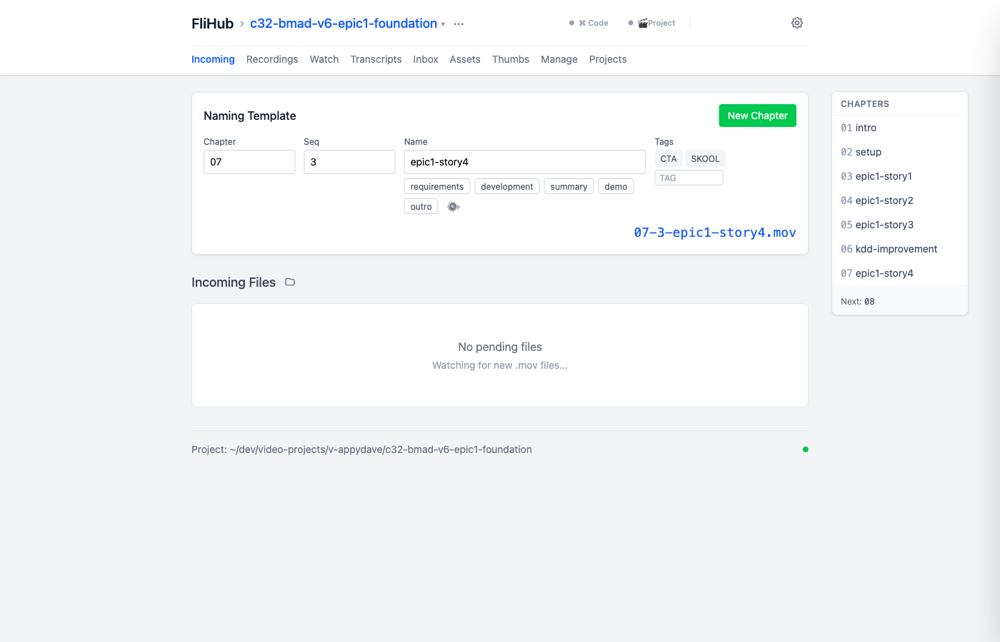

# FliHub

**The watcher behind Ecamm Live: every take you record lands in a queue, and the ones you keep become
named, transcribed recordings in the right video project.**



Stop recording and the take appears in **Incoming**. Pick a chapter and a name, and FliHub moves it
into `recordings/` as `07-3-epic1-story4.mov` and queues a local MLX Whisper transcript. The other
tabs (Recordings, Transcripts, Assets, Thumbs, Projects, Manage) work on those promoted files.

It is a local, single-creator tool in the FliVideo family. It runs on David's Macs, reads the shared
brand registry through [`@flivideo/core`](https://github.com/flivideo/fli-core), and can be pointed at a project by FliStudio
through the open contract below.

> [!NOTE]
> **Status: active, mid-rebuild.** A rewrite campaign (B475) is under way. Start with
> [docs/rebuild-2026/README.md](docs/rebuild-2026/README.md). The April `docs/prd/flihub-v2-*` /
> Baku specs are superseded.

## Features

- **Take queue → promote.** Watches `watchDirectory` for `*.mov` / `*.mp4`, holds takes until you
  pick one, then renames it `{chapter}-{sequence}-{name}-{TAGS}.mov` into the active project. B-roll
  takes go to `b-roll/` with no chapter.
- **Local transcription.** MLX Whisper on Apple Silicon writes `.txt`, `.srt` and `.json` beside
  every recording, streamed live to the UI.
- **Projects at a glance.** A filterable project table with stage, pin, transcript coverage and a
  detail drawer. It covers every project under the brand root, and a brand switcher moves between
  roots.
- **Storage lanes.** Hold heavy folders to the T7, archive whole projects to PUBLISHED, and restore
  them. The copy is verified before anything is deleted locally.
- **Assets and thumbnails.** Image assets (`05-3-2a-label.png`), prompts and YouTube thumbnails per
  project.
- **Read API for tools and agents.** `/api/query/*` returns project, recording and transcript data
  as JSON or `?format=text`.

## Get started

**Requirements:** macOS · Node ≥ 20 · npm · [Overmind](https://github.com/DarthSim/overmind) (tmux)
· ffprobe · `mlx_whisper` for transcription. Access to the private `flivideo/fli-core` repo over SSH
(it is a `github:` dependency).

```bash
npm install
cp server/config.template.json server/config.json   # first run only: set watchDirectory + projectsRootDirectory
overmind start -D                                    # detached: server :5101, UI :5100
open http://localhost:5100
```

> [!WARNING]
> Check first whether FliHub is already running (`overmind ps`, or `lsof -i :5101`). If it is, use
> `overmind restart server|client` instead of starting it again. The server kills whatever holds its
> port on startup, and `npm run dev` binds the same ports, so a second launch takes down the
> supervised one. The full launch and recovery runbook is in [CLAUDE.md](CLAUDE.md) → _Dev Server
> Management_.

Change settings in the **Config** panel rather than editing `server/config.json` while the server is
running. The server keeps config in memory and rewrites the file on every change.

## Open at a brand and project (open contract)

FliHub follows the FliVideo open contract (`flistudio/docs/open-contract.md` §3): the same context —
`brand`, `project`, optional `video` — can be set three ways, and all three run one `applyContext`
on the server (`server/src/utils/openContext.ts`).

| Door       | How                                                                                                                                                                                          | Missing argument                                                                                                    |
| ---------- | -------------------------------------------------------------------------------------------------------------------------------------------------------------------------------------------- | ------------------------------------------------------------------------------------------------------------------- |
| 1 · Picker | Brand switcher + project list in the UI                                                                                                                                                      | —                                                                                                                   |
| 2 · Launch | `./start.sh --brand appydave --project b85-demo [--video 01-intro]` · `scripts/app.sh start --brand … --project …` · or `FLIVIDEO_BRAND` / `FLIVIDEO_PROJECT` / `FLIVIDEO_VIDEO` (argv wins) | Starts as it would have, on the picker. Only `--brand` switches the brand and leaves the project list as the picker |
| 3 · API    | `POST /api/context {"brand","project","video?"}` → `200 {context}` · `400 {missing}` · `404` unknown brand/project · `409 {candidates}` ambiguous · `503` registry or brand root unreadable  | `400` naming the field                                                                                              |

`GET /api/context` returns `{ context, missing, refused? }`, derived from the live config (so a pick in the UI shows too).
`scripts/app.sh start --brand … --project …` on an app that is already running switches it through door 3.

- **Resolution** goes through `@flivideo/core`: `brands.json` → brand root on this machine (home prefix rewritten,
  `~/.fli/machine.json` override) → project by folder name, `fli.studio.json` id, or whole code.
- **Membership**: a folder with a valid `fli.studio.json` is `membership: "member"` with its `projectId`. Most FliHub
  projects have no `fli.studio.json` yet (adoption is FliStudio's job), so any other existing folder in the brand
  root is accepted as `membership: "folder"` with `projectId: null`.
- **Refusal** (unknown brand, no such folder, ambiguous code) never falls back to the last project: the config stays
  as it was, the server logs one `[context] … refused:` line, and `GET /api/context` carries `refused: { code, reason, candidates? }`.
- ⚠️ **Callers: check `refused` before `context`.** A refused launch leaves the _previous_ project open, so `context`
  can name a resolved project the launcher did not ask for. Clearing it would wipe a persisted pick on a typo, so it
  is kept on purpose (W3 review F3, option a).
- **Refusal codes — the shared Fli vocabulary** (Swagger decision 4: every Fli app answers with these, so FliStudio
  switches on one set; `REFUSAL_CODES` in `shared/contextSchemas.ts`, pinned by a test):

  | `code`                | HTTP (FliHub) | When                                                                                                                                 |
  | --------------------- | ------------- | ------------------------------------------------------------------------------------------------------------------------------------ |
  | `missing`             | 400           | door 3 without `brand` or `project` — body also carries `missing: [...]`                                                             |
  | `unknown-brand`       | 404           | brand key not in `brands.json`                                                                                                       |
  | `no-brand-root`       | 404 / 503     | 404: no `video_projects` root on this machine · 503: the root is configured but cannot be read (unmounted) — `reason` names the path |
  | `registry-unreadable` | 503           | `brands.json` absent or not valid                                                                                                    |
  | `project-not-found`   | 404           | no folder, member id or code matches                                                                                                 |
  | `project-ambiguous`   | 409           | a code matches two or more projects (members and plain folders) — `candidates` lists them                                            |
  | `not-a-project`       | —             | **never emitted by FliHub**: plain folders are accepted as `membership: "folder"`                                                    |
  | `video-invalid`       | 400           | `video` is not `<NN>-<name>`                                                                                                         |
  | `video-not-found`     | —             | **never emitted by FliHub**: the video is carried, not checked against `videos/`                                                     |

  A body of the wrong shape (e.g. `"brand": 5`) is a malformed request, not a refusal: 400 `{ error, issues }` with no `code`.

- **Restarts**: the scripts stamp each launch with `FLIVIDEO_LAUNCH_ID`; a nodemon or `overmind restart server` under
  the same launch does not re-apply it (remembered in `server/.launch-context.json`), so a later pick survives.

## Project folder layout

Each project is one folder under the brand root (`projectsRootDirectory`). Its name is its identity;
see [project codes](docs/architecture/project-codes.md).

```
<project>/
├── recordings/              # promoted takes: {NN}-{seq}-{name}-{TAGS}.mov
│   ├── -safe/               # protected recordings
│   └── -chapters/           # legacy chapter previews (no longer generated)
├── recording-transcripts/   # .txt · .srt · .json per recording
├── b-roll/                  # chapter-less takes
├── assets/{images,thumbs}/  # image assets, prompts, YouTube thumbnails
├── inbox/                   # incoming notes, datasets, presentation assets
├── final/                   # the finished cut FliHub reads (see edit folders)
├── s3-staging/              # files shared with an editor (excluded from hold/offload)
└── .flihub-state.json       # per-recording flags + project titles, chapters, dictionary
```

What `final/`, `edit-1st/` and `edit-2nd/` mean in practice: [docs/architecture/edit-folders.md](docs/architecture/edit-folders.md).

## Documentation

| Read                                                                        | For                                                                              |
| --------------------------------------------------------------------------- | -------------------------------------------------------------------------------- |
| [docs/SYSTEM.md](docs/SYSTEM.md)                                            | How FliHub works: abstractions, workflows, design decisions, failure modes       |
| [docs/AGENT-NOTES.md](docs/AGENT-NOTES.md)                                  | Pitfalls, schema sources and tooling for anyone (or any agent) changing the code |
| [docs/rebuild-2026/](docs/rebuild-2026/README.md)                           | The rebuild: North Star, roadmap, requirements archaeology                       |
| [docs/architecture/](docs/architecture/)                                    | API reference, socket protocol, naming rules, patterns                           |
| [docs/guides/](docs/guides/)                                                | Troubleshooting, cross-platform and collaborator setup                           |
| [docs/backlog.md](docs/backlog.md) · [docs/changelog.md](docs/changelog.md) | Requirements (FR/NFR) and what shipped                                           |
| [CLAUDE.md](CLAUDE.md)                                                      | Operating rules, launch modes, machine inventory                                 |

## Development

```bash
npm test             # shared, client, server (vitest)
npm run typecheck    # server + client
npm run lint
```

`npm test` locally is the real gate. CI can't install the private `fli-core` dependency yet, so it
fails before reaching the tests. Known lint and coverage debt is ticketed as NFR-172 in
[docs/backlog.md](docs/backlog.md).

## License

Private repository — AppyDave. No license is granted.
