# Chapter Timestamp Extraction Specification

**FR-34: Chapter Timestamp Extraction**

This document specifies the algorithm, rules, and decision tree for extracting YouTube chapter timestamps from video recordings. It serves three purposes:

1. **Code Reference** - The implementation should match this documented outcome
2. **Scenario Coverage** - Verify all edge cases are handled in the workflow
3. **Educational Material** - Diagrams and explanations for YouTube audience

---

## Overview

### The Problem

When creating YouTube videos, content creators record multiple clips (chapters) that are later edited into a final video. YouTube allows chapter markers in descriptions (e.g., `0:00 Introduction`), but determining the exact timestamp where each chapter appears in the final video is challenging because:

1. **Editing changes timing** - Chapters may be trimmed, reordered, or have transitions added
2. **Multiple takes** - A chapter may have several recordings, but only one is used
3. **Similar openings** - Multiple chapters may start with similar phrases ("Let's look at...")
4. **Content trimming** - The editor may cut the first few seconds of a clip

### The Solution

Match the **transcript text** from each recorded chapter against the **final video's SRT subtitle file** to find where that content appears.

```
┌─────────────────────┐         ┌─────────────────────┐
│  Recording          │         │  Final Video        │
│  Transcripts        │         │  SRT File           │
│                     │         │                     │
│  01-1-intro.txt     │    →    │  Timestamped        │
│  02-1-setup.txt     │ Match   │  subtitle           │
│  03-1-demo.txt      │    →    │  segments           │
└─────────────────────┘         └─────────────────────┘
                    ↓
            ┌───────────────┐
            │ YouTube       │
            │ Chapters      │
            │               │
            │ 0:00 Intro    │
            │ 2:34 Setup    │
            │ 5:12 Demo     │
            └───────────────┘
```

---

## Implementation Phases

This feature is implemented in phases. Each phase builds on the previous.

### Phase Summary

| Phase | Focus | Status |
|-------|-------|--------|
| **Phase 1: MVP** | Basic extraction, copy to clipboard | ✅ Complete |
| **Phase 2: UI Improvements** | 3-state colors, match explanations, bug fixes | ✅ Complete |
| **Phase 3: Algorithm Improvements** | Proper text similarity library | ✅ Complete |
| **Phase 4: LLM Fallback** | Semantic matching for uncertain cases | Future |

---

### Phase 1: MVP ✅ Complete

**What was built:**
- Parse recording transcripts and final SRT
- Multi-stage phrase matching (10, 7, 5, 3 words)
- Confidence scoring with deductions
- Duplicate resolution and out-of-order detection
- "Copy for YouTube" button
- Basic UI showing chapters with timestamps

**Acceptance Criteria:** ✅ All met
- [x] Chapters extracted from transcripts
- [x] Timestamps found in SRT
- [x] YouTube format generated
- [x] Copy to clipboard works

---

### Phase 2: UI Improvements ✅ Complete

**Why needed:** Testing with b64 revealed the current UI doesn't help users understand or fix issues.

**Issues fixed:**

| Issue | Problem | Fix |
|-------|---------|-----|
| **Confidence % meaningless** | "79% vs 85%" doesn't tell a story | Replace with 3-state colors |
| **No match explanation** | User can't see WHY a match was made | Show match reason text |
| **Lightning bolts wrong** | Chapters 29, 30 flagged when in order | Fix out-of-order logic |
| **Impossible alternatives** | Options 37 minutes apart shown | Filter to nearby timestamps only |

**3-State Color System:**

```
┌──────────────────────────────────────────────────────────────┐
│ 🟢 CONFIDENT  │ High-quality match, long phrase, no issues  │
│ 🟡 REVIEW     │ Acceptable match, may need quick check      │
│ 🔴 UNCERTAIN  │ Low-quality match, likely needs correction  │
└──────────────────────────────────────────────────────────────┘
```

**Match Reason Examples:**
- "Matched 10 words at position 0" → 🟢 CONFIDENT
- "Matched 5 words, skipped 1" → 🟡 REVIEW
- "Partial match: 5 words overlap" → 🔴 UNCERTAIN

**Acceptance Criteria:**
- [x] Replace confidence % with color badge (CONFIDENT/REVIEW/UNCERTAIN)
- [x] Show match reason as text below each chapter (visible on hover + in expanded view)
- [x] Fix lightning bolt: only show when chapter is actually out of order
- [x] Filter alternatives to within 60 seconds of primary match
- [ ] Side-by-side text comparison (transcript vs SRT snippet) - DEFERRED to Phase 3

**Files to modify:**
- `client/src/components/ChaptersPanel.tsx` - UI display
- `server/src/utils/chapterExtraction.ts` - Add match reason to response
- `shared/types.ts` - Add `matchReason` field to ChapterMatch

---

### Phase 3: Algorithm Improvements

**Why needed:** Current naive word matching produces false positives. Common phrases like "brings us to the end" match across unrelated content.

**What to implement:**

1. **Integrate `string-comparisons` library**
   ```bash
   npm install string-comparisons -w server
   ```

2. **Use established algorithms:**
   - Trigram similarity for fuzzy matching
   - Longest Common Subsequence (LCS) to preserve word order
   - Dice coefficient for set overlap

3. **Add threshold gates:**
   - Reject matches with score < 0.6
   - Only show as "match" if score >= 0.7

4. **Weight rare words higher (TF-IDF approach):**
   - Common words ("the", "so", "and") contribute less
   - Unique words ("BMAD", "Vercel", "configuration") contribute more

**Acceptance Criteria:**
- [ ] `string-comparisons` library integrated
- [ ] Matching uses Trigram + LCS combined scoring
- [ ] Threshold gates reject low-quality matches
- [ ] False positive rate reduced (measure with b64 test case)

**Files to modify:**
- `server/src/utils/chapterExtraction.ts` - Replace matching logic
- `package.json` (server) - Add dependency

---

### Phase 4: LLM Fallback

**Why needed:** Even good algorithms fail on heavily edited content where semantic meaning matters more than word matching.

**When to use LLM:**
- Confidence < 60% after algorithm pass
- User clicks "Verify" button
- "Verify All Uncertain" batch operation

**What LLM does:**
- Compare transcript snippet to SRT segment
- Answer: "Are these talking about the same topic?"
- Return confidence + explanation

**Acceptance Criteria:**
- [ ] Auto-escalate to LLM when algorithm confidence < 60%
- [ ] "Verify" button on uncertain matches
- [ ] "Verify All" button for batch verification
- [ ] LLM explanation shown in UI

**Files to modify:**
- `server/src/routes/projects.ts` - Verify endpoint (already exists)
- `client/src/components/ChaptersPanel.tsx` - Verify buttons
- `server/src/utils/chapterExtraction.ts` - Auto-escalation logic

---

### Known Issues (from b64 testing)

**Issue 1: False Positive Match**

| Transcript | Matched SRT | Problem |
|------------|-------------|---------|
| "build this complete application" | "add products or any" | Different content entirely |

**Root cause:** Algorithm matched on "brings us to the end" - a common phrase.

**Issue 2: Impossible Alternatives**

Alternatives shown at 2:01:09 and 1:23:51 (37 minutes apart). Real alternatives should be seconds apart, not hours.

**Issue 3: Wrong Lightning Bolts**

Chapters 29, 30 showed out-of-order warning, but sequence was 27→28→29→30 (correct order).

---

## Algorithm Overview


---

## Stage 1: Input Preparation

### Transcript File Parsing

Transcripts follow the naming convention: `{chapter}-{sequence}-{name}.txt`

| Example | Chapter | Sequence | Name |
|---------|---------|----------|------|
| `01-1-intro.txt` | 01 | 1 | intro |
| `02-3-setup-bmad.txt` | 02 | 3 | setup-bmad |
| `16-1-create-agent.txt` | 16 | 1 | create-agent |

**Grouping Rule**: Multiple files for the same chapter+name combination are grouped, and only the **first file** (by filename sort order) is used.

```
Files: 01-1-intro.txt, 01-2-intro.txt, 01-3-intro.txt
Result: ONE entry for chapter 01 "intro" using 01-1-intro.txt
```

**Why?** In video editing, typically only the first good take is used. Later takes are backups.

### SRT Parsing

The SRT file is parsed into timestamped segments:

```
1
00:00:02,500 --> 00:00:05,200
Welcome to this tutorial on BMAD.

2
00:00:05,300 --> 00:00:08,100
Today we'll explore the agent SDK.
```

Each segment becomes searchable with its start timestamp.

---

## Stage 2: Multi-Stage Phrase Matching

The algorithm searches for chapter text in the SRT using progressively shorter phrases. Longer matches are more reliable.


### Matching Rules Table

| Stage | Words | Min Characters | Confidence Base | Use Case |
|-------|-------|----------------|-----------------|----------|
| 1 | 10 | 10 | 100% | Unique, long opening |
| 2 | 7 | 10 | 100% | Standard opening |
| 3 | 5 | 10 | 85-100% | Short but distinct |
| 4 | 3 | 10 | 85-100% | Brief, unique phrase |
| 5 | Partial | 5+ words match | 50% | Last resort |

### Word Position Skipping

To handle trimmed content (where the editor cut the first second or two), the algorithm tries matching from different starting positions:


**Skip Positions**: 0, 1, 2 (tries first word, skip one, skip two)

### Text Normalization

Before matching, all text is normalized:

1. Convert to lowercase
2. Remove punctuation
3. Collapse multiple spaces

```
Input:  "Welcome! Let's explore the BMAD method."
Output: "welcome lets explore the bmad method"
```

---

## Stage 3: Confidence Scoring

Confidence scores tell a story about match quality. They start at 100% and receive deductions for specific issues.


### Confidence Score Reference

| Score | Meaning | Action Required |
|-------|---------|-----------------|
| 100% | Perfect match | No action needed |
| 90% | Confident (short phrase) | Review optional |
| 80% | Good (minor issue) | Quick review |
| 70% | Acceptable (some concern) | Should review |
| 65% | Low confidence | Manual verification |
| 50% | Partial match only | Likely needs correction |
| <50% | Very uncertain | Manual timestamp needed |

### Deduction Table

| Issue | Deduction | Rationale |
|-------|-----------|-----------|
| Partial word match (not phrase) | Base 50% | Fundamentally uncertain |
| Very short phrase (< 5 words) | -15 | Less distinct, more collision risk |
| Short phrase (5-6 words) | -10 | Moderate collision risk |
| Skipped 1 word | -5 | Content may be trimmed |
| Skipped 2 words | -10 | Content likely trimmed |
| Skipped 3+ words | -15 (max) | Significant trimming |
| Out of order | -20 | Major editing detected |

---

## Stage 4: Duplicate Resolution

When multiple chapters match the same SRT segment (collision), the algorithm resolves conflicts:

```mermaid
flowchart TB
    subgraph "Duplicate Detection"
        C1["Chapter 13: 'intro'<br/>→ Segment 45"]
        C2["Chapter 14: 'intro'<br/>→ Segment 45"]
        C3["Chapter 15: 'demo'<br/>→ Segment 45"]
    end

    subgraph "Resolution"
        K["Keep: Chapter 13<br/>(lowest number)"]
        R1["Re-match: Chapter 14<br/>(skip first 15 words)"]
        R2["Re-match: Chapter 15<br/>(skip first 15 words)"]
    end

    C1 --> K
    C2 --> R1
    C3 --> R2

    R1 --> |"Exclude segment 45"| N1["New match or<br/>low confidence"]
    R2 --> |"Exclude segment 45"| N2["New match or<br/>low confidence"]
```



### Resolution Algorithm

1. **Detect**: Group matches by SRT segment index
2. **Priority**: Keep the match with the lowest chapter number
3. **Re-match others**:
   - Exclude already-claimed segments
   - Skip first 15 words (to avoid common opening phrases)
   - If no new match found, mark as low confidence (-30 penalty)

---

## Stage 5: Out-of-Order Detection

Chapters in the final video should generally appear in numerical order. When they don't, it suggests potential mismatches or intentional editing choices.

### Definition: What IS Out-of-Order?

A chapter is **out of order** if it **jumps forward** significantly from the previous chapter, indicating it was placed earlier in the video than expected.

**Examples:**
```
Timeline: ch1 → ch2 → ch40 → ch3 → ch4 → ch6 → ch7 → ch8 → ch9 → ch19 → ch10

Out-of-order: ch40 (jumped from 2 to 40)
Out-of-order: ch19 (jumped from 9 to 19)

NOT out-of-order: ch3, ch4, ch6, ch7... (normal sequence after ch40)
NOT out-of-order: ch10 (comes after ch19, but ch10 didn't jump)
```

### Detection Algorithm

```mermaid
flowchart TB
    subgraph "For Each Chapter (by timestamp)"
        P["Previous chapter number"] --> G{"Gap = Current - Previous"}
        G --> |"Gap > 5"| OO["⚡ OUT OF ORDER<br/>This chapter jumped forward"]
        G --> |"Gap ≤ 5"| OK["✓ In sequence<br/>(small gaps are normal)"]
    end
```



**Rules:**
1. Calculate `gap = currentChapter - previousChapter`
2. If `gap > MAX_GAP` (default: 5), flag CURRENT chapter as out-of-order
3. Small gaps (like ch4 → ch6, skipping ch5) are acceptable
4. First chapter flagged if > MAX_GAP (e.g., video starts with ch40)

### Why This Definition?

The chapter that **jumped forward** is the one that was **edited into an unexpected position**. Subsequent chapters that follow in sequence are NOT the problem - they're in their natural order relative to each other.

```
✗ OLD LOGIC: "ch3 is out of order because ch40 came before it"
✓ NEW LOGIC: "ch40 is out of order because it jumped from ch2"
```

**Note**: Intentional reordering does happen in editing. The lightning bolt ⚡ flags for review, not automatic rejection.

---

## Decision Tree: When to Use LLM Verification


### Escalation Thresholds

| Confidence | Action | Rationale |
|------------|--------|-----------|
| >= 80% | Auto-accept | High reliability |
| 60-79% | Show with review option | Usable but verify |
| 40-59% | Show alternatives | User should pick |
| < 40% | Offer LLM verification | Algorithm uncertain |
| 0% (not found) | LLM or manual entry | No algorithmic match |

---

## Edge Cases & Scenarios

### Scenario 1: Common Opening Phrases

**Problem**: Multiple chapters start with "So let's take a look at..."

```
Chapter 10: "So let's take a look at the configuration..."
Chapter 14: "So let's take a look at the deployment..."
```

**Solution**:
- 10-word phrase differentiates them
- If collision occurs, duplicate resolution re-matches with deeper text

### Scenario 2: Trimmed Content

**Problem**: Editor cuts the first word or two of a clip.

```
Transcript: "Right, so welcome to today's tutorial"
SRT:        "So welcome to today's tutorial"  (missing "Right,")
```

**Solution**: Word position skipping tries positions 0, 1, 2

### Scenario 3: Chapter Reordering

**Problem**: Editor moves chapter 11 to appear after chapter 14 in final video.

**Solution**:
- Out-of-order detection flags this (-20 confidence)
- User sees the warning and can verify it's intentional

### Scenario 4: Multiple Takes

**Problem**: Three recordings exist for chapter 05.

```
05-1-intro.txt  (first take)
05-2-intro.txt  (second take)
05-3-intro.txt  (third take)
```

**Solution**: Grouping keeps only 05-1-intro.txt (first by sort order)

### Scenario 5: No Match Found

**Problem**: Chapter content doesn't appear in final video (cut entirely).

**Solution**:
- Status: `not_found`
- Confidence: 0%
- Alternatives shown if any partial matches exist

### Scenario 6: Very Short Chapter

**Problem**: Chapter is only 5 seconds of content.

```
Transcript: "Thanks for watching"
```

**Solution**:
- 3-word minimum phrase match
- Short phrase penalty (-15) reflects uncertainty
- User may need to verify

---

## Data Flow Diagram


---

## API Response Format

```typescript
interface ChapterMatch {
  chapter: number           // Chapter number (1-99)
  name: string              // kebab-case name
  displayName: string       // Human readable ("Setup BMAD")
  timestamp?: string        // YouTube format ("2:34")
  timestampSeconds?: number // Seconds from start
  confidence: number        // 0-100
  status: 'matched' | 'low_confidence' | 'not_found' | 'verified'
  matchedText?: string      // SRT text that matched
  transcriptSnippet?: string // First ~100 chars of transcript
  alternatives?: {          // Other potential matches
    timestamp: string
    timestampSeconds: number
    confidence: number
    matchedText: string
    matchMethod: 'phrase' | 'partial'
  }[]
}
```

---

## Confidence Distribution Example

From a real project with 36 chapters:

| Confidence | Count | Interpretation |
|------------|-------|----------------|
| 100% | 3 | Perfect long phrase matches |
| 90% | 1 | Good match, minor skip |
| 80% | 21 | Standard matches |
| 70% | 4 | Short phrases, need review |
| 65% | 7 | Very short or skipped words |

This distribution tells a clear story:
- Most matches (58%) are confident
- Some (11%) need review
- A few (19%) should be verified

---

## Implementation Reference

**Source Code**: `server/src/utils/chapterExtraction.ts`

**Key Functions**:
- `extractChapters()` - Main orchestration
- `getChaptersFromTranscripts()` - Parse and group transcript files
- `parseSrt()` - Parse SRT into segments
- `findMatchInSrt()` - Multi-stage phrase matching
- `findAllMatchesInSrt()` - Get all candidates for alternatives
- `calculateConfidence()` - Score based on match quality

---

## Glossary

| Term | Definition |
|------|------------|
| **Chapter** | A logical section of video content (e.g., "Introduction", "Setup") |
| **Transcript** | Text file containing what was spoken in a recorded clip |
| **SRT** | SubRip Subtitle format - timestamped text segments |
| **Phrase Match** | Finding an exact sequence of words |
| **Partial Match** | Finding individual words (not in sequence) |
| **Collision** | Multiple chapters matching the same timestamp |
| **Out-of-Order** | Chapter appearing at an unexpected timestamp |
